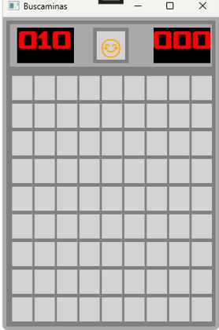
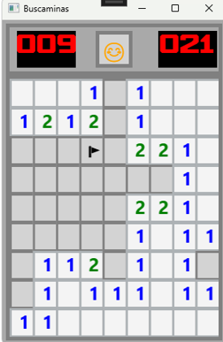
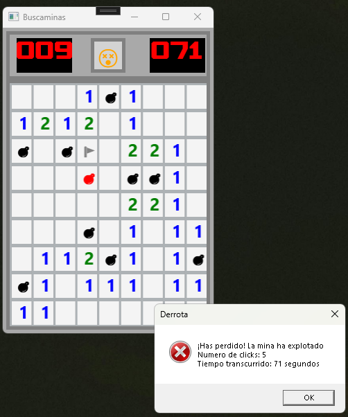

# 💣 Buscaminas (WPF)

Implementación del clásico juego del Buscaminas desarrollada en **C#** con **WPF** (Windows Presentation Foundation), como actividad evaluable de la asignatura de Desarrollo de Interfaces (2º DAM).

## 📋 Descripción

Interfaz gráfica que reproduce la mecánica original del Buscaminas: un tablero de **9x9 casillas** con **10 minas** distribuidas aleatoriamente. El objetivo es descubrir todas las casillas que no contienen minas, evitando hacer clic sobre ellas.

Al descubrir una casilla sin minas adyacentes, el juego revela automáticamente todas las casillas conectadas sin minas cercanas (relleno en cascada), mostrando en cada casilla descubierta el número de minas adyacentes con un color distinto según la cantidad.

## ✨ Características

- **Tablero 9x9** generado dinámicamente con 10 minas colocadas de forma aleatoria.
- **Apertura en cascada** de casillas vacías y sus adyacentes.
- **Código de colores** según el número de minas cercanas para facilitar la lectura del tablero.
- **Marcado de minas** con el botón derecho del ratón, mostrando un icono identificativo en la casilla marcada.
- **Contador de minas restantes** que se actualiza en tiempo real al marcar/desmarcar casillas.
- **Temporizador de partida** implementado con `DispatcherTimer`.
- **Botón de reinicio** (carita sonriente) que reinicia el tablero y vuelve a habilitar el juego.
- **Fin de partida**: al pulsar sobre una mina se revelan todas las minas del tablero, se resalta en otro color la casilla que ha hecho explotar la partida y cambia el icono de reinicio.
- **Ventana de resultado** al finalizar la partida (victoria/derrota), incluyendo número de clics realizados y tiempo transcurrido.

## 🛠️ Tecnologías

- **Lenguaje:** C#
- **Framework:** WPF (.NET)
- **IDE:** Visual Studio
- **Interfaz:** XAML (`Grid`, `TextBlock`, `Button`)

## 🧩 Arquitectura del proyecto

El juego se organiza en una clase principal que centraliza el estado de la partida (dimensiones del tablero, matrices de casillas y minas, contadores) y expone los métodos encargados de la lógica y de la interacción con la interfaz:

| Método | Función |
|---|---|
| `InicializarTablero()` | Genera el tablero vacío y coloca las minas de forma aleatoria. |
| `ContarMinasCerca()` / `ActualizarMinasCerca()` | Calcula y asigna el número de minas adyacentes a cada casilla. |
| `AbrirCasilla()` / `MostrarNumeroCasillas()` | Descubre casillas y propaga la apertura en cascada cuando no hay minas cercanas. |
| `CrearBotonesTablero()` | Genera dinámicamente los botones del tablero y sus eventos. |
| `CasillaButton_Click()` / `CasillaButton_RightClick()` | Gestionan la apertura de casillas y el marcado/desmarcado de minas. |
| `MostrarTodasLasMinas()` | Revela el tablero completo al perder la partida. |
| Métodos de victoria/derrota | Comprueban las condiciones de fin de juego y muestran el resultado. |
| `BotonReset_Click()` | Reinicia el tablero para una nueva partida. |
| `Temporizador_TickTock()` | Actualiza el contador de tiempo mientras dura la partida. |

El marcador de minas y el temporizador se han diseñado visualmente como un reloj digital (fondo negro, números rojos), para reforzar la estética clásica del juego.

## 🖼️ Capturas de pantalla

| Tablero inicial | Partida en curso | Fin de partida |
|:---:|:---:|:---:|
|  |  |  |

## 🚀 Posibles mejoras

- Adaptar el juego a diferentes tamaños de tablero y niveles de dificultad.
- Representación gráfica de las minas en lugar de texto/iconos simples.
- Añadir efectos de sonido al marcar minas o al explotar una mina.
- Selector de dificultad (número de minas configurable).
- Modo cuenta atrás para añadir presión de tiempo a la partida.

## ▶️ Cómo ejecutarlo

1. Clona el repositorio.
2. Abre la solución (`.sln`) con Visual Studio.
3. Compila y ejecuta el proyecto (F5).

---

*Proyecto desarrollado como actividad evaluable de Desarrollo de Interfaces — 2º DAM.*